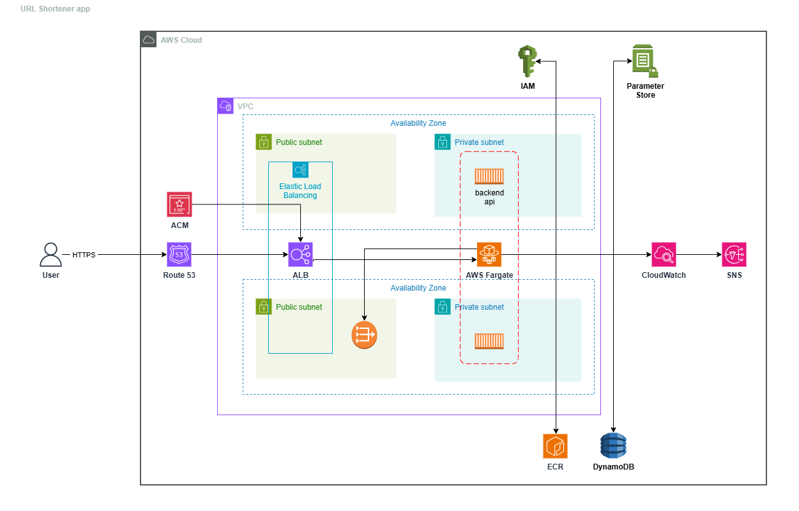

# URL Shortener, AWS Infrastructure

A production-grade infrastructure for a URL shortener API, simulating real-world DevOps practices across three environments **(QA, staging, prod)**. Built with Terraform modules, GitHub Actions CI/CD, OIDC authentication, and full observability via CloudWatch. Every decision here, from network topology to the deployment pipeline, reflects how infrastructure is actually managed at companies that care about operational maturity.

> **Live:** The infrastructure is torn down when not actively demoed to manage AWS costs. It can be fully reprovisioned in under 10 minutes via `terraform apply`. Reach out if you'd like a live walkthrough.
>
> - `https://maissen.tech`, prod
> - `https://staging.maissen.tech`, staging
> - `https://qa.maissen.tech`, QA

---

## Architecture



The system runs on AWS inside a VPC spread across two availability zones. Each AZ has a public and a private subnet. The Application Load Balancer lives in the public subnets and terminates HTTPS using an ACM-managed certificate. ECS Fargate tasks run in the private subnets and are never publicly reachable, inbound traffic flows only from the ALB's security group. A NAT Gateway in each public subnet gives tasks outbound internet access for pulling ECR images and reaching AWS APIs.

DynamoDB handles persistence. The access pattern for a URL shortener (key-value lookups by short code) maps naturally to DynamoDB's model, and it avoids the operational overhead of managing a database server. SSM Parameter Store holds any configuration the application needs at runtime. Route 53 routes `maissen.tech` (prod), `staging.maissen.tech` (staging), and `qa.maissen.tech` (QA) to their respective ALBs via alias records.

Three environments, **QA**, **staging**, and **prod**, are separate Terraform state files applied from the same modules with different variable inputs.

---

## Screenshots

**GitHub Actions, Terraform pipeline on pull request**
<!-- Screenshot: PR showing the plan output posted as a comment for all three environments, with fmt/validate/tflint checks passing. Shows the pipeline structure and plan diff clearly. -->


**GitHub Actions, Application pipeline deploying to staging**
<!-- Screenshot or GIF: The application pipeline running end to end, test, build, push to ECR, deploy to ECS staging, smoke test passing. A GIF works well here if you can capture the full run. -->


**CloudWatch dashboard, prod environment**
<!-- Screenshot: The CloudWatch dashboard showing live metrics, ALB request count, ECS CPU/memory, DynamoDB consumed capacity. Captures that monitoring is actually configured and running. -->


**Live endpoint, curl output**
<!-- Screenshot: Terminal showing `curl -i https://api.yourdomain.xyz/health` returning HTTP 200 with the JSON response and a valid TLS certificate. Simple but proves the stack is end-to-end working. -->


> **Note on screenshots vs GIFs:** Use a GIF for the pipeline run (it conveys the sequential nature of the stages better than a static screenshot). Use static screenshots for the dashboard and curl output, they're cleaner and load faster.

---

## Repository Structure

```
.
├── .github/workflows/        # CI/CD pipelines for Terraform
│
├── bootstrap/
│   ├── remote-state/         # S3 bucket + DynamoDB lock table, applied once manually
│   ├── github-oidc/          # IAM identity provider + role for GitHub Actions OIDC
│   └── ecr/                  # ECR repository for application images
│
├── environments/
│   ├── qa/                   # QA environment, auto-applied on merge to main
│   ├── staging/              # Staging environment, requires manual approval to apply
│   └── prod/                 # Prod environment, requires manual approval to apply
│
└── modules/
    ├── networking/            # VPC, subnets, IGW, NAT, route tables, VPC flow logs
    ├── compute/               # ECS cluster, task definition, service, IAM roles, ALB
    ├── storage/               # DynamoDB table, SSM parameters
    └── monitoring/            # CloudWatch log groups, dashboard, alarms, SNS topic
```

Bootstrap resources are intentionally separated from environment infrastructure. They are applied once and never touched by the automated pipeline. Modules contain no environment-specific logic, all variation comes from variables passed in by each environment's `main.tf`.

---

## How to Deploy

**Prerequisites:** AWS CLI configured, Terraform >= 1.6, Docker, pre-commit.

**1. Install pre-commit hooks** (run once after cloning):

```bash
pip install pre-commit
pre-commit install
```

**2. Bootstrap remote state** (run once, manually):

```bash
cd bootstrap/remote-state
terraform init
terraform apply
```

> Before running `terraform init` in any directory with a `backend.hcl`, update that file with your actual S3 bucket name, key path, and region. Remote state must exist before any environment can be initialized.

**3. Bootstrap OIDC trust for GitHub Actions** (run once):

```bash
cd ../github-oidc
terraform init -backend-config=backend.hcl
terraform apply
```

**4. Bootstrap ECR repository** (run once):

```bash
cd ../ecr
terraform init -backend-config=backend.hcl
terraform apply
```

**5. Push an initial image to ECR:**

```bash
aws ecr get-login-password --region AWS_REGION | \
  docker login --username AWS --password-stdin AWS_ACCOUNT_ID.dkr.ecr.AWS_REGION.amazonaws.com

docker build -t ECR_REPO_NAME:latest DOCKERFILE_PATH
docker tag ECR_REPO_NAME:latest AWS_ACCOUNT_ID.dkr.ecr.AWS_REGION.amazonaws.com/ECR_REPO_NAME:latest
docker push AWS_ACCOUNT_ID.dkr.ecr.AWS_REGION.amazonaws.com/ECR_REPO_NAME:latest
```

> After the initial push, the application CI/CD pipeline handles all subsequent image builds and deployments automatically.

**6. Deploy an environment:**

```bash
cd environments/staging
terraform init -backend-config=backend.hcl
terraform apply -var-file=terraform.tfvars
```

---

## How to Work With This

**First-time setup** requires the three bootstrap steps in order: `remote-state` → `github-oidc` → `ecr`. These are applied manually from a local terminal with appropriate AWS credentials. After that, all infrastructure changes flow through the CI/CD pipeline.

**Updating infrastructure** works through pull requests. Open a PR against `main`, the pipeline runs `fmt`, `validate`, `tflint`, and `terraform plan` for all three environments, posting plan output as a PR comment. Merge triggers an automatic apply to QA. After QA is verified, a manual approval gate controls the staging and prod apply.

**Environment-specific values** live at `environments/<env>/terraform.tfvars`. Anything that differs between environments, task counts, alarm thresholds, domain names, tags, lives here. Nothing environment-specific is hardcoded in modules.

**Image deployments** are handled by the application pipeline in the [backend repo](https://github.com/maissen/url-shortener-backend). On merge to main, it builds the Docker image, tags it with the git commit SHA, pushes to ECR, and updates the ECS service in QA automatically.

---

## CI/CD

Three workflows live in `.github/workflows/`:

**`terraform.yaml`** → the main orchestrator. Triggers on pull requests and pushes to `main`. On PR: runs `_plan.yaml` for all three environments and posts results as comments. On merge: runs `_apply.yaml` for QA automatically, then waits for manual approval before applying to staging and prod.

**`_plan.yaml`** → reusable workflow. Runs `fmt -check`, `validate`, `tflint`, and `plan` for a given environment. Called by the orchestrator with the target environment as input.

**`_apply.yaml`** → reusable workflow. Runs `apply -auto-approve` for a given environment. Requires the plan to have run in the same pipeline execution.

### GitHub Setup

Create three GitHub Actions environments in your repository settings:

- `qa`
- `staging`
- `prod`

Configure `staging` and `prod` with required reviewers to enforce the manual approval gate before deployments.

Declare the following in your repository's **Variables** section:

| Variable | Description |
|---|---|
| `AWS_REGION` | AWS region for all deployments |
| `TF_VERSION` | Terraform version to use in workflows |
| `AWS_ROLE_ARN_QA` | IAM role ARN for QA deployments |
| `AWS_ROLE_ARN_STAGING` | IAM role ARN for staging deployments |
| `AWS_ROLE_ARN_PROD` | IAM role ARN for prod deployments |

Authentication uses **OIDC**, no long-lived AWS credentials are stored in GitHub. Each environment assumes a dedicated IAM role scoped to the minimum permissions required for that environment's Terraform operations.

---

## Security

**IAM roles are split by concern.** The ECS task execution role gives ECS permission to pull images from ECR and write logs to CloudWatch. The task role gives the application permission to read from DynamoDB and fetch its SSM parameters, nothing else. Both roles are scoped to specific resource ARNs, not wildcards.

**Security groups follow least privilege.** The ALB security group accepts HTTPS from `0.0.0.0/0`. The ECS security group accepts traffic only from the ALB's security group on the application port. No direct inbound access to tasks from the internet.

**Secrets come from SSM Parameter Store.** The task definition references parameter ARNs, values are injected at container startup by ECS. No sensitive values appear in environment variable blocks, Terraform state, or source code.

**ECR image scanning is enabled on push.** Every image is automatically scanned for known CVEs on arrival. The application pipeline also runs Trivy before pushing, providing a second layer of scanning before an image reaches the registry.

**TLS termination is handled by ACM.** The certificate is provisioned and renewed automatically, no manual rotation, no expiry risk, no private key material to manage or store.

---

## Monitoring

CloudWatch handles observability. Each environment writes structured JSON logs to a dedicated log group with **15-day retention**.

A CloudWatch dashboard per environment displays: ALB request count, ALB 4xx and 5xx error rates, ECS CPU and memory utilization, and DynamoDB consumed read/write capacity, on a single screen.

Alarms fire when ECS CPU or memory exceeds 80% for five consecutive minutes, or when the ALB 5xx error rate exceeds 1%. All alarms publish to an SNS topic that delivers to email. A composite alarm aggregates the critical signals. ECS service autoscaling targets **80% CPU utilization**, with a minimum of two tasks on prod (ensuring real cross-AZ high availability) and one on QA and staging.

---

## Cost Estimate

Running the full three-environment stack continuously costs approximately **$250–310/month**. The table below breaks down the main cost drivers based on current us-east-1 pricing.

| Service | Per environment | Notes |
|---|---|---|
| NAT Gateway | ~$33/month each | Largest fixed cost, $0.045/hr per gateway, regardless of traffic |
| ALB | ~$18–22/month each | Base LCU cost, scales with traffic |
| ECS Fargate | ~$15–30/month each | Depends on task size and count; 0.25 vCPU / 0.5 GB baseline |
| DynamoDB | ~$0–2/month | On-demand mode; well within always-free tier at low traffic |
| CloudWatch | ~$3–8/month each | Logs ingestion + dashboard + alarms |
| Route 53 | ~$1–2/month | Hosted zone + queries |
| ECR | ~$1/month | Storage for recent images; lifecycle policy keeps this near zero |
| ACM | Free | Certificate provisioning and renewal at no cost |

> Cost estimates are approximations based on us-east-1 pricing as of April 2026. Actual costs vary by region, traffic volume, and log ingestion rate.

---

## Lessons Learned

The piece of this project that forced the most real thinking was IAM. The surface area seems small, two roles per ECS service, but getting it genuinely right took several iterations. The first version of the task role was too broad because it was easier to test with more permissions and the plan was to tighten it later. "Later" kept getting pushed. Eventually I sat down and worked out exactly which DynamoDB actions the application actually calls and which SSM parameter paths it needs, and wrote the policy to match that exactly. The discipline required to do that upfront rather than defaulting to `*` on resources is something I now build in from the start.

The second thing I underestimated was remote state sequencing. The bootstrap components have an implicit dependency order: `remote-state` must exist before anything else can use a backend, `github-oidc` must exist before the pipeline can authenticate, `ecr` must exist before the pipeline can push images. None of this is enforced by Terraform, it is operational knowledge. Documenting the correct order explicitly, and understanding why each piece must exist before the others, removed a class of confusion that would otherwise surface during any disaster recovery scenario.

If I were scaling this further, I would separate the state bucket per environment rather than using key prefixes in one bucket, a small change now, a significant blast radius reduction later. I would also move the CloudWatch dashboard definitions into a templating layer rather than static Terraform resources; they become brittle as metrics change and rebuilding them by hand does not scale. Both are the kind of tradeoff that only becomes visible when you have lived with the system for a while.